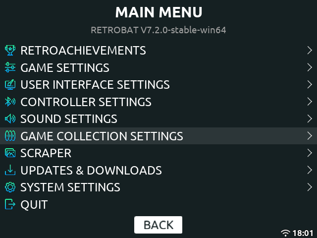
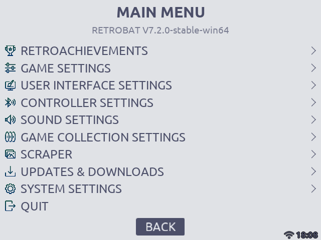

# Atlas

**Atlas** is a minimal and information-rich EmulationStation theme, designed to display all available game metadata clearly, even on low-resolution handheld screens.

Originally built for Knulli on a RG40XX H, Atlas is lightweight and fully compatible with any EmulationStation setup, including RetroBat and similar frontends.

## Features

- ✅ Full metadata visibility — nothing is hidden, even on small screens  
- 🎨 Multiple color schemes (light and dark), based on popular palettes like Nord, Dracula, Monokai, Catppuccin, and Everforest  
- ⚙️ Customizable UI: toggle animations, text scroll speed, background type and opacity, font size, and more  
- 🕹️ Configurable help icons with controller styles from major consoles (PS, Xbox, Wii U, etc.)  
- 🖼️ Optional CRT filter effect for extra retro vibes  
- 💨 Optimized for performance — includes options to disable video backgrounds and reduce resource usage on low-power devices

## Preview

|||
|-|-|
|   |  |
|   |  |

## Installation

1. Download or clone this repository.  
2. Copy the `atlas` folder into your EmulationStation themes directory.  
3. In EmulationStation, go to UI Settings → Theme Set and select **Atlas**.  
4. Restart EmulationStation if needed.

## Scraper Settings

To ensure correct layout and visuals, the following scraper settings are recommended:
|||
|-|-|
|**Image Source**| Screenshot|
|**Box Source**| 3D Box|
|**Logo Source**| Wheel|
|**Overwrite Media**| Enabled|
|**Video**| Enabled (*optional*)|

Map, Manual and PadToKey will display an icon in the top left if available.

Other configurations may still work, but this setup is ideal for best results with the theme.

## Credits

- System backgrounds and logos from the [CKAU Theme](https://github.com/CkauNui/ckau-book) and its [addons](https://github.com/CkauNui/ckau-book-addons-Consoles) by [CkauNui](https://github.com/CkauNui)  
- Menu icons made by Freepik from [Flaticon](https://www.flaticon.com)  
- Controller icons from [Those Awesome Guys – Controller Prompts](https://thoseawesomeguys.com/prompts/)  
- Fonts: [Ubuntu](https://design.ubuntu.com/font/), [Tektur](https://fonts.google.com/specimen/Tektur), [Saira](https://fonts.google.com/specimen/Saira)

## License

This project is licensed under the **Creative Commons Attribution-ShareAlike 4.0 International (CC BY-SA 4.0)**.  
See the [LICENSE](./LICENSE) file for details.
